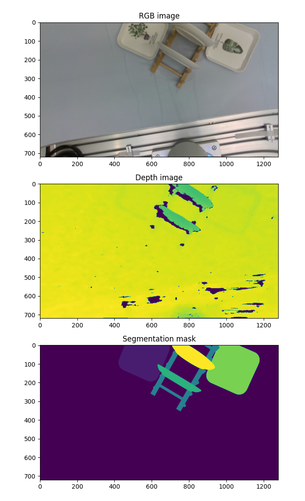
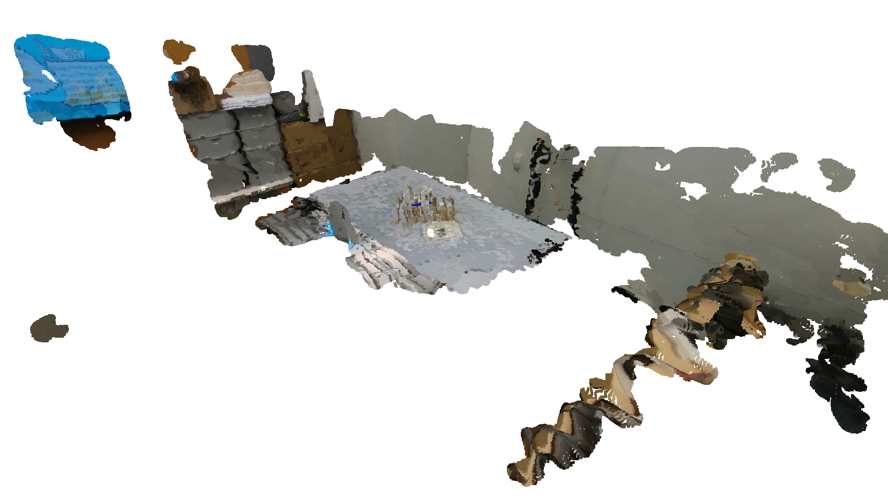

.. _example_loaddata:

Loading Raw Data and Annotations from OCRTOC Dataset
====================================================

Get an OCRTOC_Dataset instance.

.. literalinclude:: ../../examples/example_loaddata.py
    :lines: 1-15

Load Basic Data of the Dataset
^^^^^^^^^^^^^^^^^^^^^^^^^^^^^^

Get the scene name list and object name list.

.. literalinclude:: ../../examples/example_loaddata.py
    :lines: 17-21

::

    >>> Scene Name List:['20210514145021', '20210512155054', '20210512190905', '20210514160611', '20210512162257', '20210512193958', '20210512172413', '20210512192744', '20210514144306', '20210513174414', '20210512205642', '20210513164100', '20210513142015', '20210512190246', '20210512162915', '20210512160954', '20210514143530', '20210513194727', '20210514111238', '20210514161250', '20210514195047', '20210518161954', '20210512192153', '20210513172744', '20210512201548', '20210514140333', '20210513165934', '20210513192326', '20210513195423', '20210513175711', '20210514170038', '20210512170033', '20210512195935', '20210513143105', '20210512183218', '20210513193056', '20210513190529', '20210512183823', '20210512202138', '20210514155912', '20210512160321', '20210513141404', '20210513175041', '20210512161623', '20210512171024', '20210514162359', '20210514172140', '20210512154044', '20210512185449', '20210512210305', '20210513163302', '20210512173413', '20210513170610', '20210512205046', '20210518161144', '20210514173849', '20210512203625', '20210514113313', '20210512155657', '20210514114425', '20210512165405', '20210513164740', '20210514171448', '20210512195212', '20210513172121', '20210514115510', '20210513193756', '20210518155843', '20210514151634', '20210514141130', '20210512171704', '20210514194454', '20210513173805', '20210512200854', '20210514150211', '20210513191333']
    >>> Object Name List:['glue_1', 'square_plate_1', 'suger_2', 'potato_chip_2', 'small_clamp', 'lipton_tea', 'phillips_screwdriver', 'book_1', 'round_plate_1', 'orion_pie', 'plate_holder', 'round_plate_4', 'book_2', 'plastic_banana', 'power_drill', 'round_plate_2', 'potato_chip_1', 'potato_chip_3', 'square_plate_3', 'square_plate_4', 'large_clamp', 'glue_2', 'extra_large_clamp', 'suger_1', 'round_plate_3', 'large_marker', 'medium_clamp', 'flat_screwdriver', 'scissors', 'book_3', 'correction_fuid', 'square_plate_2', 'mini_claw_hammer_1']
    >>> Object Id Dict:{'glue_1': 1, 'square_plate_1': 2, 'suger_2': 3, 'potato_chip_2': 4, 'small_clamp': 5, 'lipton_tea': 6, 'phillips_screwdriver': 7, 'book_1': 8, 'round_plate_1': 9, 'orion_pie': 10, 'plate_holder': 11, 'round_plate_4': 12, 'book_2': 13, 'plastic_banana': 14, 'power_drill': 15, 'round_plate_2': 16, 'potato_chip_1': 17, 'potato_chip_3': 18, 'square_plate_3': 19, 'square_plate_4': 20, 'large_clamp': 21, 'glue_2': 22, 'extra_large_clamp': 23, 'suger_1': 24, 'round_plate_3': 25, 'large_marker': 26, 'medium_clamp': 27, 'flat_screwdriver': 28, 'scissors': 29, 'book_3': 30, 'correction_fuid': 31, 'square_plate_2': 32, 'mini_claw_hammer_1': 33}

Get the global stats.

.. literalinclude:: ../../examples/example_loaddata.py
    :lines: 23-27

::

    >>> Totally 76 scenes, 33 different objects, 6004 images
    >>> scene 3 has 79 images

Load Raw Data and Annotations
^^^^^^^^^^^^^^^^^^^^^^^^^^^^^

Load raw RGB image, depth image and Segmentation mask:

.. literalinclude:: ../../examples/example_loaddata.py
    :lines: 29-54

Load a partial view point cloud of an image:

.. literalinclude:: ../../examples/example_loaddata.py
    :lines: 56-58

.. image:: _static/2.png

Load full view point cloud for a scene

.. literalinclude:: ../../examples/example_loaddata.py
    :lines: 60-62

