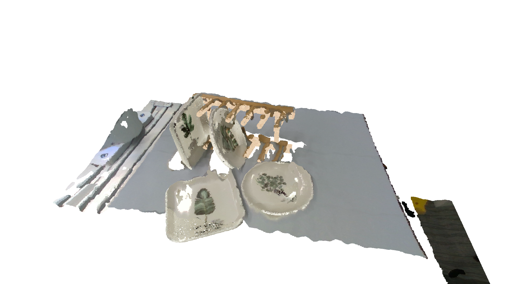

.. _example_vis_6dpose:

Loading Raw Data and Annotations from OCRTOC Dataset
====================================================

Get a OCRTOC_Dataset instance.

.. literalinclude:: ../../examples/example_vis_6dpose.py
    :lines: 1-16

Visualize Object Pose on 2D Image
^^^^^^^^^^^^^^^^^^^^^^^^^^^^^^^^^

.. literalinclude:: ../../examples/example_vis_6dpose.py
    :lines: 18-26

Visualize Object Pose in 3D Space
^^^^^^^^^^^^^^^^^^^^^^^^^^^^^^^^^

.. literalinclude:: ../../examples/example_vis_6dpose.py
    :lines: 28-37

